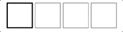
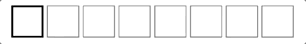
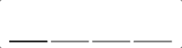

# React Native Smooth Pincode Input

A cross-platform, smooth, lightweight, customizable PIN code input component for React Native.

Most PIN code inputs components implemented by combining several TextInputs. They works, however, not good enough. When user types fast, or system sluggish, characters may lost when component switching focus between TextInputs. User need to type over and over again to get a correct input, gave a frustrated user experience.

**React Native Smooth Pincode Input** implemented with a different approach - It's based on single TextInput but only render it as seperated fields. In other words, it looks like a PIN code input, but works as smooth as a native TextInput.

**React Native Smooth Pincode Input** is also highly customizable. By exposing cells and text stylesheets, it can be fully customized to fit in your app design. Password mode also supported with customizable mask characters as well as placeholders.

- Checkout the [example/](https://github.com/xamous/react-native-smooth-pincode-input/tree/master/example) for demo app.

## Features

- Smooth typing without losing inputs
- Customizable cell style
- Customizable text style
- Password mode
- Customizable password mask and placeholder characters
- Built in shake animation (Credit to [react-native-animatable](https://github.com/oblador/react-native-animatable))

## Installation

```sh
# yarn
yarn add react-native-smooth-pincode-input

# npm
npm i react-native-smooth-pincode-input
```

## Examples

### Default style with event handling


```js
<SmoothPinCodeInput
  ref={this.pinInput}
  value={code}
  onTextChange={code => this.setState({ code })}
  onFulfill={this._checkCode}
  onBackspace={this._focusePrevInput}
  />
```

### Password with custom mask


```js
<SmoothPinCodeInput password mask="﹡"
  cellSize={36}
  codeLength={8}
  value={password}
  onTextChange={password => this.setState({ password })}/>
```

### Underline style


```js
<SmoothPinCodeInput
  cellStyle={{
    borderBottomWidth: 2,
    borderColor: 'gray',
  }}
  cellStyleFocused={{
    borderColor: 'black',
  }}
  value={code}
  onTextChange={code => this.setState({ code })}
  />
```

### Customized style


```js
<SmoothPinCodeInput
  placeholder="⭑"
  cellStyle={{
    borderWidth: 2,
    borderRadius: 24,
    borderColor: 'mediumturquoise',
    backgroundColor: 'azure',
  }}
  cellStyleFocused={{
    borderColor: 'lightseagreen',
    backgroundColor: 'lightcyan',
  }}
  textStyle={{
    fontSize: 24,
    color: 'salmon'
  }}
  textStyleFocused={{
    color: 'crimson'
  }}
  value={code}
  onTextChange={code => this.setState({ code })}
  />
```


## Available props

| Name             | Type                                                                                  | Default                                    | Description                                                                                 |
| ---------------- | ------------------------------------------------------------------------------------- | ------------------------------------------ | ------------------------------------------------------------------------------------------- |
| value            | String                                                                                | ''                                         | The value to show for the input                                                             |
| codeLength       | Number                                                                                | 4                                          | Number of character for the input                                                           |
| cellSize         | Number                                                                                | 48                                         | Size for each cell in input                                                                 |
| cellSpacing      | Number                                                                                | 4                                          | Space between each cell                                                                     |
| placeholder      | String                                                                                | ''                                         | Placeholder for each cell                                                                   |
| mask             | String                                                                                | '*'                                        | Character masking for each cell. Usable with `password` props                               |
| password         | Boolean                                                                               | false                                      | Mask the input value. Each cell masked with `mask` props                                    |
| autoFocus        | Boolean                                                                               | false                                      | If true, focuses the input on `componentDidMount`                                           |
| containerStyle   | React View StyleSheet                                                                 | `{}`                                       | View style for whole cell containers                                                        |
| cellStyle        | React View StyleSheet                                                                 | `{ borderColor: 'gray', borderWidth: 1}`   | View style for each cell                                                                    |
| cellStyleFocused | React View StyleSheet                                                                 | `{ borderColor: 'black', borderWidth: 2 }` | View style for focused cell                                                                 |
| textStyle        | React Text StyleSheet                                                                 | `{ color: 'gray', fontSize: 24 }`          | Text style for cell value                                                                   |
| textStyleFocused | React Text StyleSheet                                                                 | `{ color: 'black' }`                       | Text style for focused cell value                                                           |
| onFulfill        | Function                                                                              | null                                       | Callback function that's called when the input is completely filled                         |
| onTextChange     | Function                                                                              | null                                       | Callback function that's called when the text changed                                       |
| onBackspace      | Function                                                                              | null                                       | Callback function that's called when the input is empty and the backspace button is pressed |
| keyboardType     | Enum('default', 'number-pad', 'decimal-pad', 'numeric', 'email-address', 'phone-pad') | 'numeric'                                  | Determines which keyboard to open                                                           |

## Thanks to contributors
* [Matias Alvin](https://github.com/alvinmatias69)
* [Marcus Vinicius](https://github.com/MarcwL22)
* [Fellipe Chagas](https://github.com/chagasaway)
* [Erjan Kalybek](https://github.com/erjanmx)
* [Sankaran Kaliappan](https://github.com/hisankaran)
* [Anthony Mittaz](https://github.com/sync)
* [Marco van Dijk](https://github.com/marcovdijk)